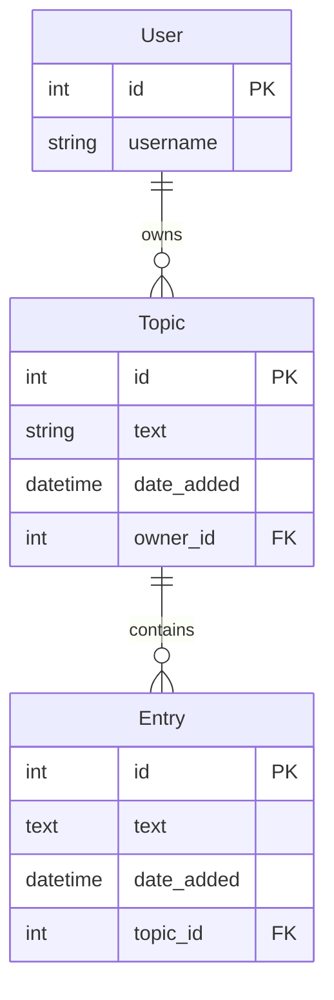

# Learning Journal

A small, personal journal app built with Django. Create topics, add timestamped
entries to each one, and keep everything private to your own account.

Built as a guided learning project in the style of _Python Crash Course_.


## Features

- **User accounts** — register, log in, and log out.
- **Private data** — each topic belongs to its owner; you only ever see your own journal (owner checks on every view).
- **Topics & entries** — add topics, add and edit entries under each topic.
- **Bootstrap 5 UI** — styled with `django-bootstrap5`.

## Architecture



A standard Django **Model-View-Template** flow: a request hits an entry in
`mypett/urls.py`, routes to a view, the view queries the models, and the
template renders the response. Authenticated views are guarded with
`@login_required` and per-owner checks.

## Getting started

Requirements: Python 3.11+ and [uv](https://docs.astral.sh/uv/).

```sh
# 1. Install dependencies into the project virtualenv
uv sync

# 2. Create your local secrets file
cp .env.example .env

# 3. Set a secret key in .env (generate one with the command below)
uv run python -c "from django.core.management.utils import get_random_secret_key; print(get_random_secret_key())"

# 4. Apply the database schema
uv run python manage.py migrate

# 5. Run the dev server
uv run python manage.py runserver
```

Open <http://127.0.0.1:8000>, then **Register** to create your first account.

> **Note:** this project ships development-only defaults (`DEBUG=True`, a
> non-secret fallback key). It is not configured for production deployment.

## Testing

```sh
uv run python manage.py test
```

## Project structure

```
startup/
├── config/      # Django project: settings, root URLs
├── mypett/      # Main app: topics and entries
├── users/       # Accounts app: register, login, logout
├── pyproject.toml
├── uv.lock
└── README.md
```

`db.sqlite3`, `.env`, and `.venv` are git-ignored — the database and secrets
stay local.

## Tech stack

| Piece    | Choice                         |
| -------- | ------------------------------ |
| Backend  | Django 5.2 (Python 3.11)       |
| Database | SQLite (default Django dev DB) |
| UI       | django-bootstrap5              |
| Secrets  | python-dotenv (loads `.env`)   |
| Tooling  | uv                             |

## Useful commands

| Command                                  | Purpose              |
| ---------------------------------------- | -------------------- |
| `uv run python manage.py check`          | Sanity check         |
| `uv run python manage.py makemigrations` | Draft schema changes |
| `uv run python manage.py migrate`        | Apply schema changes |
| `uv run python manage.py runserver`      | Start dev server     |
| `uv run python manage.py test`           | Run tests            |

## Notes

- This is a learning project — the focus is on understanding Django's model-view-template flow, forms, authentication, and URL routing, not production hardening.
